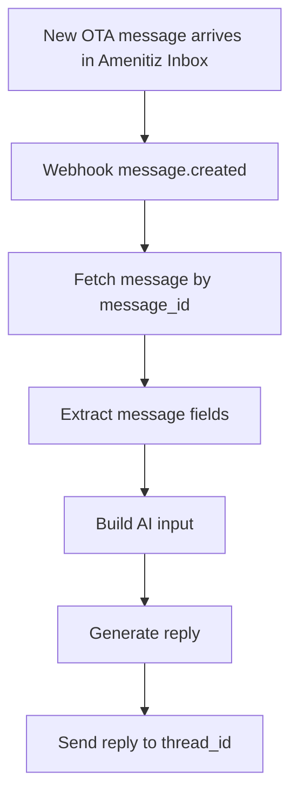

````markdown
# User onboarding
Opzione consigliata: prefill dell’email + account linking guidato

Nota: in Alfred la struttura dati è:
- user account
  - property 1 - subscription 1
  - property 2 - subscription 2
  - ecc..

## Flusso
1. Host clicca “Alfred” nel Amenitiz Marketplace
2. Amenitiz apre Alfred con un “handoff” (redirect o embedded) e passa:
   - `amenitiz_account_id`
   - `email` (dell’utente Amenitiz)
   - (opzionale) `name`
3. Alfred mostra signup/login con:
   - email precompilata (non editabile o editabile con warning)
4. Alfred chiede una conferma esplicita tipo:
   - “Continua con questa email per creare/collegare il tuo account Alfred”
5. Se l’email esiste già in Alfred → login/link
6. Se non esiste → signup rapido

### Perché è “safe”
- niente account creati di nascosto
- consenso esplicito (“continua”)
- l’host capisce che sta collegando due sistemi

## Dati minimi da passare da Amenitiz ad Alfred (handoff)
Obbligatori:
- `amenitiz_account_id`
- `email` (obbligatorio per prefill)

Consigliati:
- `amenitiz_user_id` (audit e collegamento stabile)

Opzionali:
- `name`
- `locale` / `language`

## Extra che migliora molto il mapping property (se Amenitiz può)
Dopo il login/signup, Alfred usa l’accesso Amenitiz per:
- fetch lista properties dell’account Amenitiz (non “tutte”)
- far selezionare quali attivare

## Mermaid flow

### Source code
```mermaid
sequenceDiagram
    autonumber

    participant Host
    participant AmenUI as Amenitiz UI
    participant AmenBE as Amenitiz Backend
    participant AlfFE as Alfred Frontend
    participant AlfBE as Alfred Backend

    Host->>AmenUI: Click "Alfred" in Marketplace
    AmenUI->>AmenBE: Prepare marketplace handoff

    AmenBE->>AlfFE: Redirect with context
    Note right of AlfFE: Payload = amenitiz_account_id, amenitiz_user_id, email, name(opt), locale(opt)

    AlfFE->>Host: Show signup/login (email prefilled)
    Host->>AlfFE: Confirm continue

    alt Alfred account exists
        AlfFE->>AlfBE: Login user
    else New Alfred account
        AlfFE->>AlfBE: Create account
    end

    AlfBE->>AlfBE: Link amenitiz_account_id to alfred_account

    AlfBE->>AmenBE: Fetch properties for amenitiz_account_id
    AmenBE-->>AlfBE: Property list (property_id, name, status)

    AlfBE->>AlfFE: Show property list
    Host->>AlfFE: Select properties to enable
    AlfFE->>AlfBE: Submit selected properties

    AlfBE->>AlfBE: Create property mappings (amenitiz_property_id -> alfred_property_id)

    AlfBE->>AlfFE: Integration ready
    AlfFE->>Host: Confirmation screen
````

---

# Calendar sync data flow (Reservation Store)

Obiettivo: mantenere in Alfred un “calendario backup” delle prenotazioni (per WhatsApp auth e contesto multi-canale).
Nota: per ora includiamo solo il trigger temporale (no event trigger).

## Source code

```mermaid
flowchart TD

    A[Amenitiz calendar export available]
    B[Scheduled sync trigger]
    C[Fetch calendar export]
    D[Parse reservations]
    E[Upsert Reservation Store in Alfred]
    F[Attach integration metadata when available]
    G[Reservation Store ready for WhatsApp auth]

    A --> B
    B --> C
    C --> D
    D --> E
    E --> F
    F --> G
```

---

# Guest message data flow (Messaging)

Obiettivo: gestire i messaggi OTA in Amenitiz Inbox usando info minime (message id + contenuto).
Nota: il contesto prenotazione (se necessario) viene recuperato dal Reservation Store o da fetch dedicati, ma qui manteniamo il flow messaging “minimal”.

## Source code



---

# API requirements

## Autenticazione e autorizzazione (OAuth 2.0)

La comunicazione tra Alfred e Amenitiz avverrà tramite OAuth 2.0 in modalità server-to-server. Amenitiz fornirà ad Alfred le credenziali necessarie per ottenere un access token associato a uno specifico account Amenitiz. Alfred utilizzerà tale token come Bearer token per effettuare chiamate API autorizzate (ad esempio per leggere i messaggi della inbox o inviare risposte).
Il token sarà limitato per scope (es. `inbox:read`, `inbox:write`) e potrà avere una scadenza definita, in linea con i requisiti di sicurezza di Amenitiz. I dettagli relativi al ciclo di vita del token (refresh, rotazione, revoca) saranno definiti congiuntamente durante la fase di implementazione.

---

## Amenitiz → Alfred

### 1) Webhook: nuovo messaggio (trigger)

(opzionale, ma raccomandato)

* **POST** `/webhooks/amenitiz/messages.created`
* **Scopo:** notificare che è arrivato un nuovo messaggio OTA
* **Payload minimo:**

  * `event_id`
  * `thread_id`
  * `message_id`
  * `occurred_at`

Note:

* Trigger only (non source of truth)
* Non include contenuto messaggio o contesto prenotazione

---

### 2) Fetch message by message_id (source of truth per il contenuto del messaggio)

(obbligatoria)

* **GET** `/v1/inbox/messages`
* **Scopo:** recuperare il messaggio vero a partire da `message_id`
* **Query params:**

  * `message_id` (obbligatorio in questo flow)
* **Response item (minimal):**

  * `thread_id`
  * `message_id`
  * `sender_type`
  * `message_content`
  * `received_at`

---

## Alfred → Amenitiz

### 3) Send reply to thread

(obbligatoria)

* **POST** `/v1/inbox/threads/{thread_id}/reply`
* **Scopo:** inviare la risposta di Alfred nella inbox Amenitiz / OTA
* **Payload:**

  * `reply_text`
  * `sender` = `alfred`
  * `idempotency_key`
  * `reply_to_message_id` (optional)

---

## Amenitiz → Alfred (Calendar export)

### 4) Fetch calendar export

(obbligatoria per il Reservation Store)

* **GET** `/v1/calendar/export` *(path indicativo)*
* **Scopo:** ottenere l’export calendario da sincronizzare periodicamente
* **Response:** file calendario (es. `.ics`) o equivalente strutturato

> Nota: il path e il formato esatto vanno allineati con Amenitiz. In questa proposta lo trattiamo come “calendar export endpoint”.

---

# Recap

| Componente              | Cosa significa                                 | Chi sviluppa | Chi usa           |
| ----------------------- | ---------------------------------------------- | ------------ | ----------------- |
| Webhook sender          | Amenitiz genera l’evento e invia HTTP POST     | Amenitiz     | Alfred (riceve)   |
| Webhook receiver URL    | Alfred espone l’URL che riceve la POST         | Alfred       | Amenitiz (chiama) |
| Inbox Message Fetch API | Alfred legge il messaggio via API              | Amenitiz     | Alfred            |
| Reply API               | Alfred invia risposta al thread                | Amenitiz     | Alfred            |
| Calendar Export API     | Alfred sincronizza prenotazioni periodicamente | Amenitiz     | Alfred            |

---

# Punti aperti da allineare durante l’implementazione

* Modello di autenticazione (OAuth/scambio token)
* Firma dei webhook e policy di retry
* Rate limit e strategia di polling
* Formato e endpoint del calendar export (ICS o equivalente)
* Conservazione dei dati e responsabilità di compliance

```
```
