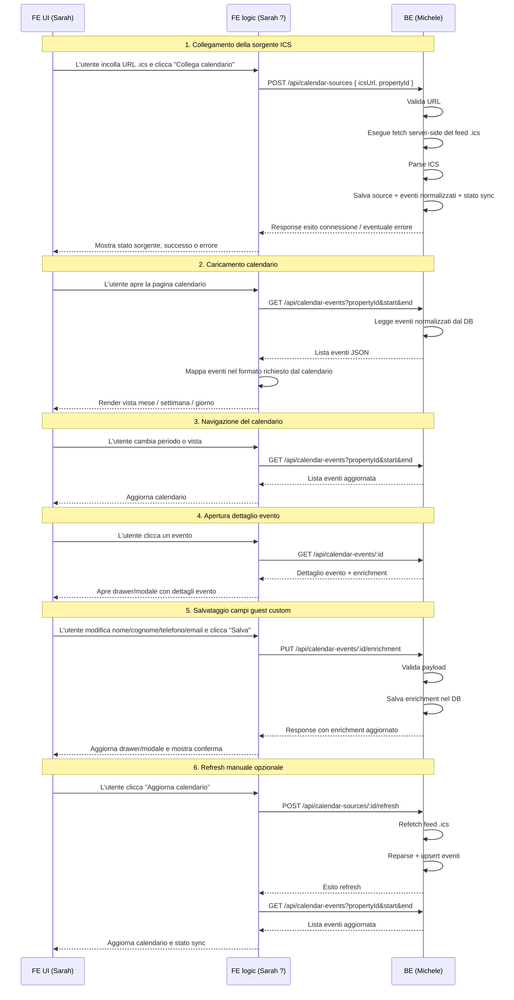
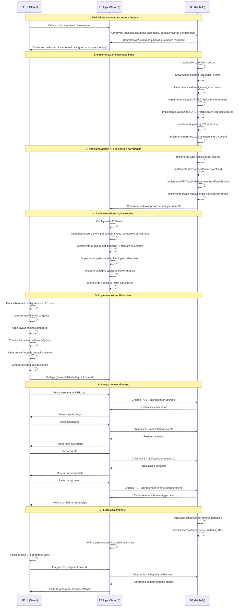

# Feature spec: visualizzatore calendario ICS con dettagli evento e campi guest personalizzati

## Obiettivo

Realizzare una feature nel frontend React che permetta a un utente di:

1. collegare un calendario esterno incollando un URL `.ics`
2. visualizzare gli eventi prenotazione nelle viste giorno, settimana e mese
3. cliccare un evento per aprirne i dettagli
4. aggiungere e modificare facoltativamente campi extra per quell'evento:
   - nome
   - cognome
   - telefono
   - email
5. salvare questi campi extra nel backend per usi interni successivi

Il feed `.ics` è la sorgente degli eventi di calendario.  
I campi extra sono dati interni della nostra applicazione e devono essere salvati separatamente nel backend.


## Flusso atteso



## Stack di riferimento

### Frontend
- React
- FullCalendar React per la visualizzazione del calendario

### Backend
- Python Flask
- parser ICS in Python
- fetch server-side del feed `.ics`
- job schedulato per la sincronizzazione periodica
- API JSON per il frontend

### Database
Qualsiasi database già in uso dal progetto, purché consenta:
- persistenza delle sorgenti calendario
- persistenza degli eventi normalizzati
- persistenza dei campi guest custom

---

## Decisione architetturale

Il frontend **non deve leggere direttamente il feed `.ics`** come soluzione principale di produzione.

### Motivi
- il server remoto potrebbe bloccare le richieste dal browser
- potrebbero esserci problemi di CORS
- il feed potrebbe essere lento o temporaneamente irraggiungibile
- sarebbe difficile collegare agli eventi i dati custom salvati nel nostro sistema
- il parsing e la normalizzazione sono responsabilità più corrette del backend

### Architettura corretta
- l'utente incolla l'URL `.ics` nel frontend
- il frontend invia l'URL al backend Flask
- il backend valida e salva l'URL
- il backend scarica e parse il feed `.ics`
- il backend normalizza gli eventi e li salva nel DB
- il backend espone API JSON per il frontend
- il frontend mostra il calendario usando solo le API interne
- il frontend salva i campi guest extra nel backend

---

## Ambito

### In scope
- aggiunta di una sorgente calendario tramite URL `.ics`
- validazione e salvataggio della sorgente
- download e parsing del feed remoto
- normalizzazione degli eventi
- visualizzazione viste mese / settimana / giorno
- click evento per apertura dettaglio
- visualizzazione dati evento provenienti dal feed ICS
- aggiunta e modifica di campi custom per l'evento selezionato
- salvataggio dei campi custom nel backend
- refresh del feed e aggiornamento degli eventi
- gestione delle ricorrenze dove possibile
- gestione base di stato sincronizzazione ed errori

### Fuori scope per questa fase
- scrittura di modifiche verso il calendario esterno
- creazione di nuovi eventi sul calendario esterno
- modifica drag and drop degli eventi ICS
- messaggistica ospiti
- allegati
- fusione di più feed ICS in un solo calendario, salvo futura richiesta esplicita

---

## Assunzioni di prodotto

1. L'utente fornisce un URL `.ics`.
2. L'URL può essere pubblicamente leggibile oppure può fallire per restrizioni del server remoto.
3. Il feed `.ics` è la fonte di verità per date e orari degli eventi esterni.
4. Il nostro sistema arricchisce quegli eventi con metadati interni.
5. I campi guest personalizzati sono facoltativi e non devono per forza esistere nel feed `.ics` originale.

---

## User flow

## A. Collegare la sorgente calendario
1. L'utente apre le impostazioni del calendario.
2. L'utente incolla un URL `.ics`.
3. L'utente clicca **Collega calendario**.
4. Il frontend invia l'URL al backend.
5. Il backend valida:
   - formato URL
   - raggiungibilità della risorsa
   - contenuto compatibile con ICS / iCalendar
   - presenza di eventi parsabili oppure feed valido anche se vuoto
6. Il backend salva la sorgente.
7. Il backend avvia una sync iniziale.
8. Il frontend mostra il risultato della connessione e lo stato di sincronizzazione.

## B. Visualizzare il calendario
1. L'utente apre la pagina calendario.
2. Il frontend richiede al backend gli eventi normalizzati.
3. L'utente può passare tra:
   - Mese
   - Settimana
   - Giorno
4. L'utente può navigare al periodo precedente o successivo.
5. Gli eventi vengono mostrati nel calendario.

## C. Visualizzare il dettaglio evento
1. L'utente clicca su un evento.
2. Il frontend apre un pannello laterale o una modale.
3. Il pannello mostra:
   - titolo
   - data e ora di inizio
   - data e ora di fine
   - indicazione all-day se applicabile
   - descrizione se presente
   - location se presente
   - informazioni sulla sorgente calendario

## D. Aggiungere campi guest interni
1. L'utente modifica:
   - nome
   - cognome
   - telefono
   - email
2. L'utente clicca **Salva**.
3. Il frontend invia questi campi al backend collegandoli all'evento esterno.
4. Il backend salva i dati e restituisce il record aggiornato.
5. Il frontend aggiorna il pannello dettaglio.

---

## Requisiti UX

## Pagina principale calendario
Usare un layout standard con:
- toolbar superiore
- etichetta con il periodo corrente
- navigazione precedente / successivo / oggi
- pulsanti per **Mese**, **Settimana**, **Giorno**
- griglia calendario con eventi

## Interazione evento
Il click su un evento deve aprire un pannello dettaglio senza portare l'utente fuori dalla pagina calendario.

## Struttura consigliata del pannello dettaglio
### Sezione 1. Dati prenotazione
- Titolo
- Inizio
- Fine
- Sì/No all-day
- Descrizione
- Location
- Nome sorgente calendario

### Sezione 2. Dati guest
- Nome
- Cognome
- Telefono
- Email

### Sezione 3. Stato tecnico
- Ultima sincronizzazione
- Sorgente sync
- Evento collegato correttamente sì/no

Questa sezione può essere nascosta agli utenti non admin.

---

## Requisiti funzionali

## 1. Gestione sorgente calendario

### FR-1.1 Aggiunta sorgente
Il sistema deve permettere a un utente di registrare un URL `.ics` per una property o account.

**Input**
- `ics_url`

**Validazioni**
- deve essere un URL valido
- deve usare `http` o `https`
- il backend deve tentare il fetch remoto
- il backend deve verificare che il contenuto sia compatibile con ICS / iCalendar

### FR-1.2 Aggiornamento sorgente
Il sistema deve permettere di sostituire l'URL `.ics` esistente.

### FR-1.3 Disattivazione sorgente
Il sistema deve permettere di disattivare la sorgente senza cancellare i dati di arricchimento già salvati internamente.

### FR-1.4 Stato sorgente
Il sistema deve tracciare:
- stato sorgente: `active | invalid | unreachable | disabled`
- timestamp ultima sync riuscita
- timestamp ultima sync fallita
- ultimo messaggio di errore

---

## 2. Sincronizzazione e parsing

### FR-2.1 Fetch backend
Il backend Flask deve scaricare il feed `.ics` remoto tramite richiesta HTTP server-side.

### FR-2.2 Parsing eventi
Il backend Flask deve estrarre gli eventi dal feed usando una libreria Python dedicata al parsing ICS.

### FR-2.3 Normalizzazione campi
Il backend deve trasformare ogni evento nel nostro modello interno.

### FR-2.4 Gestione ricorrenze
Il backend deve gestire correttamente le ricorrenze dove supportato dalla libreria Python scelta.

### FR-2.5 Gestione timezone
Il backend deve preservare la timezone originale quando disponibile e restituire date e orari in formato coerente.

### FR-2.6 Identità univoca evento
Il backend deve identificare gli eventi principalmente tramite `UID` dell'ICS quando presente.

### FR-2.7 Strategia refresh
Il backend deve supportare:
- sync iniziale alla creazione della sorgente
- endpoint di refresh manuale
- job schedulato periodico

**Suggerimento di default:** refresh ogni 5-15 minuti.

### FR-2.8 Persistenza locale
Gli eventi parsati devono essere salvati nel database applicativo. Il frontend non deve dipendere da parsing live a ogni caricamento pagina.

---

## 3. Rendering eventi

### FR-3.1 Viste
Il frontend deve supportare:
- vista mese
- vista settimana
- vista giorno

### FR-3.2 Navigazione
Il frontend deve supportare precedente, successivo e oggi.

### FR-3.3 Visualizzazione eventi
Ogni evento deve mostrare almeno:
- titolo
- timing
- blocco compatto nel calendario

### FR-3.4 Loading states
Il frontend deve mostrare uno stato di caricamento mentre richiede gli eventi.

### FR-3.5 Error states
Il frontend deve mostrare errori chiari per:
- sorgente calendario non configurata
- sorgente non valida
- sync fallita
- nessun evento restituito

---

## 4. Dettaglio evento

### FR-4.1 Apertura dettaglio
Al click sull'evento, il frontend deve aprire una modale o un drawer laterale.

### FR-4.2 Visualizzazione campi sorgente
Mostrare i campi del feed quando presenti:
- `summary` mappato su titolo
- `description`
- `location`
- `start`
- `end`
- stato all-day

### FR-4.3 Gestione campi mancanti
Se un campo non esiste nel feed, mostrare uno stato vuoto tipo:
- “Non fornito dalla sorgente calendario”

Non inventare valori.

---

## 5. Arricchimento guest interno

### FR-5.1 Campi custom modificabili
Per ogni evento esterno, l'utente può aggiungere o modificare:
- nome
- cognome
- telefono
- email

### FR-5.2 Salvataggio separato
Questi campi devono essere salvati nel backend, non scritti nel feed `.ics`.

### FR-5.3 Collegamento all'evento
I campi custom devono essere collegati all'evento esterno tramite:
- id sorgente interno
- UID ICS
- fallback secondario se UID mancante

### FR-5.4 Persistenza dopo refresh
Se il feed esterno viene aggiornato, i campi custom devono restare collegati finché l'evento è ancora riconoscibile.

### FR-5.5 Validazione email
L'email deve essere validata sintatticamente.

### FR-5.6 Validazione telefono
Il telefono può avere validazione permissiva in fase 1. Dove possibile, normalizzare il formato senza bloccare numeri internazionali ragionevoli.

---

## Modello dati

## 1. Tabella sorgenti calendario

Tabella suggerita: `calendar_sources`

Campi:
- `id`
- `property_id` o riferimento equivalente al proprietario
- `source_type` = `ics`
- `ics_url`
- `status` = `active | invalid | unreachable | disabled`
- `last_successful_sync_at`
- `last_failed_sync_at`
- `last_error_message`
- `created_at`
- `updated_at`

---

## 2. Tabella eventi calendario esterni normalizzati

Tabella suggerita: `external_calendar_events`

Campi:
- `id`
- `calendar_source_id`
- `ics_uid`
- `external_sequence` nullable
- `title`
- `description`
- `location`
- `start_at`
- `end_at`
- `is_all_day`
- `raw_timezone` nullable
- `raw_event_hash` nullable
- `raw_payload` JSON nullable
- `first_seen_at`
- `last_seen_at`
- `is_cancelled` boolean default false
- `created_at`
- `updated_at`

### Note
- `ics_uid` deve essere indicizzato
- valutare indice univoco su `(calendar_source_id, ics_uid, start_at)` se le ricorrenze generano più occorrenze con lo stesso UID
- mantenere il payload raw se utile per supporto e debug

---

## 3. Tabella arricchimento evento

Tabella suggerita: `external_event_enrichment`

Campi:
- `id`
- `external_calendar_event_id`
- `guest_first_name`
- `guest_last_name`
- `guest_phone`
- `guest_email`
- `created_at`
- `updated_at`

### Note
- per la fase 1 basta una relazione uno-a-uno
- in futuro il modello può essere esteso per note, storico o più ospiti

---

## Regole di matching durante la sync

Quando il feed ICS viene aggiornato, il backend deve cercare una corrispondenza in questo ordine:

1. stesso `calendar_source_id`
2. stesso `ics_uid`
3. se le ricorrenze generano più occorrenze con lo stesso UID, usare anche la data/ora di inizio dell'occorrenza
4. se manca l'UID, usare un hash di fallback basato su:
   - titolo
   - start
   - end
   - description

### Importante
Il matching basato su UID è la strategia preferita.

---

## Specifica API

## 1. Collegare sorgente calendario

### `POST /api/calendar-sources`

Crea o aggiorna una sorgente calendario ICS.

**Request**
```json
{
  "propertyId": "prop_123",
  "type": "ics",
  "icsUrl": "https://example.com/calendar.ics"
}
```

**Response**
```json
{
  "id": "src_123",
  "propertyId": "prop_123",
  "type": "ics",
  "icsUrl": "https://example.com/calendar.ics",
  "status": "active",
  "lastSuccessfulSyncAt": "2026-03-22T18:20:00Z",
  "lastFailedSyncAt": null,
  "lastErrorMessage": null
}
```

**Errori**
- `400` URL non valido
- `422` URL raggiungibile ma contenuto non valido come ICS
- `424` sorgente remota non raggiungibile
- `500` errore interno di parsing

---

## 2. Leggere stato sorgente

### `GET /api/calendar-sources/:id`

Restituisce metadata della sorgente e stato sync.

---

## 3. Refresh manuale

### `POST /api/calendar-sources/:id/refresh`

Forza un refresh del feed ICS.

**Response**
```json
{
  "status": "ok",
  "refreshedAt": "2026-03-22T18:25:00Z",
  "importedEvents": 24,
  "updatedEvents": 3,
  "cancelledEvents": 1
}
```

---

## 4. Ottenere eventi per rendering calendario

### `GET /api/calendar-events`

Query params:
- `propertyId`
- `start`
- `end`

**Request example**  
`GET /api/calendar-events?propertyId=prop_123&start=2026-03-01T00:00:00Z&end=2026-04-01T00:00:00Z`

**Response**
```json
[
  {
    "id": "evt_001",
    "calendarSourceId": "src_123",
    "icsUid": "booking-abc-001@example.com",
    "title": "Reserved",
    "start": "2026-03-22T15:00:00Z",
    "end": "2026-03-25T10:00:00Z",
    "allDay": false,
    "description": "Reservation imported from ICS",
    "location": null,
    "enrichment": {
      "firstName": "Mario",
      "lastName": "Rossi",
      "phone": "+39 333 1234567",
      "email": "mario@example.com"
    }
  }
]
```

### Nota per il frontend
Questo endpoint deve restituire dati già normalizzati per il rendering in FullCalendar.

---

## 5. Ottenere dettaglio singolo evento

### `GET /api/calendar-events/:id`

Restituisce un evento con campi sorgente e arricchimento.

---

## 6. Salvare campi custom

### `PUT /api/calendar-events/:id/enrichment`

**Request**
```json
{
  "firstName": "Mario",
  "lastName": "Rossi",
  "phone": "+39 333 1234567",
  "email": "mario@example.com"
}
```

**Response**
```json
{
  "eventId": "evt_001",
  "enrichment": {
    "firstName": "Mario",
    "lastName": "Rossi",
    "phone": "+39 333 1234567",
    "email": "mario@example.com"
  },
  "updatedAt": "2026-03-22T18:30:00Z"
}
```

**Errori di validazione**
- `400` payload non valido
- `422` email non valida
- `404` evento non trovato

---

## Requisiti backend Flask

## 1. Fetch server-side del feed
Il backend Flask deve scaricare il file ICS via HTTP server-side.

### Comportamento richiesto
- timeout configurabile
- gestione errori di connessione
- gestione status code non 200
- logging degli errori di fetch

## 2. Parsing ICS in Python
Il backend Flask deve usare una libreria Python per:
- leggere eventi
- leggere `UID`
- leggere `DTSTART` e `DTEND`
- leggere `SUMMARY`, `DESCRIPTION`, `LOCATION`
- gestire ricorrenze dove supportato
- gestire timezone

## 3. Normalizzazione
Mappare i campi ICS così:
- `UID` → `ics_uid`
- `SUMMARY` → `title`
- `DESCRIPTION` → `description`
- `LOCATION` → `location`
- `DTSTART` → `start_at`
- `DTEND` → `end_at`

## 4. Cancellazioni
Se il parser o il feed indicano eventi cancellati, salvarli e nasconderli dalla UI standard salvo necessità di supporto/admin.

## 5. Timezone
Salvare timestamp normalizzati in UTC per query e filtraggio, ma preservare anche la timezone originale quando presente.

## 6. Caching e persistenza
Gli eventi parsati devono essere salvati nel DB. Il frontend non deve aspettare il parsing live del feed a ogni caricamento pagina.

## 7. Scheduler
Il backend deve prevedere una strategia di refresh periodico. Soluzioni accettabili:
- APScheduler dentro l'applicazione o in un worker dedicato
- Celery se il progetto usa già code e worker
- cron esterno che richiama un job o endpoint interno dedicato

La scelta concreta dipende dall'infrastruttura già esistente.

## 8. Osservabilità
Loggare almeno:
- durata fetch
- errori di parsing
- numero eventi importati
- numero eventi aggiornati
- variazioni di stato della sorgente

---

## Requisiti frontend

## Pacchetti consigliati
- `@fullcalendar/react`
- `@fullcalendar/daygrid`
- `@fullcalendar/timegrid`

## Comportamento FE
1. Al caricamento pagina, richiedere gli eventi al backend per il range date visibile.
2. Renderizzare gli eventi in FullCalendar.
3. A ogni cambio vista o navigazione, richiedere il nuovo range se necessario.
4. Al click su evento, chiamare l'API dettaglio se i dati completi non sono già presenti.
5. Aprire drawer laterale o modale.
6. Consentire modifica dei campi guest interni.
7. Salvare tramite endpoint enrichment.

## Configurazioni display FE
- vista di default: `timeGridWeek` oppure `dayGridMonth`, da decidere come prodotto
- supporto localizzazione lingua
- supporto gestione timezone coerente con le impostazioni applicative
- spinner di caricamento durante il fetch

---

## Requisiti sicurezza e privacy

1. Trattare l'URL `.ics` come dato sensibile di configurazione.
2. Non esporre inutilmente l'URL raw in UI dopo il salvataggio.
3. Limitare chi può configurare o sostituire la sorgente.
4. Validare e sanitizzare tutti i campi di arricchimento inseriti dall'utente.
5. Non assumere che il feed ICS contenga dati personali.
6. Se i campi guest interni contengono PII, proteggerli con le normali regole di autorizzazione applicativa.

---

## Gestione errori

## Errori setup sorgente
- formato URL non valido
- server remoto non raggiungibile
- contenuto remoto non valido come ICS
- autenticazione richiesta o accesso negato dal server remoto
- timeout

## Errori sync
- fallimento temporaneo remoto
- payload evento malformato
- fallimento espansione ricorrenze
- errore parsing timezone

## Comportamento UI
- se il prodotto lo consente, mantenere visibili gli eventi presenti in cache anche se l'ultima sync fallisce
- mostrare timestamp ultima sync riuscita
- mostrare messaggi chiari per l'utente finale
- mantenere dettagli tecnici nei log

---

## Requisiti non funzionali

1. La pagina calendario deve caricarsi dalle API interne, non dal parsing live del feed remoto.
2. L'API eventi deve supportare filtraggio per intervallo date.
3. La sync deve essere idempotente.
4. Sync ripetute non devono creare eventi duplicati.
5. Il sistema deve tollerare feed che omettono campi opzionali come description o location.
6. Il sistema deve essere progettato in modo da poter aggiungere altri campi custom in futuro.

---

## Acceptance criteria

### AC-1 Connessione sorgente
- l'utente può incollare un URL `.ics` e salvarlo
- il backend valida l'URL e restituisce successo o errore chiaro
- lo stato sorgente viene salvato

### AC-2 Import eventi
- il backend scarica il feed ICS
- il backend parse gli eventi e salva record normalizzati
- le ricorrenze sono gestite in base alle capacità della libreria Python scelta

### AC-3 Rendering calendario
- il frontend mostra gli eventi nelle viste mese, settimana e giorno
- l'utente può navigare tra i periodi
- gli eventi sono caricati da API backend

### AC-4 Dettaglio evento
- il click su un evento apre il dettaglio
- il dettaglio mostra i dati ICS quando presenti
- campi mancanti non rompono la UI

### AC-5 Arricchimento guest
- l'utente può salvare nome, cognome, telefono, email su un evento
- i valori persistono dopo refresh pagina
- i valori restano collegati anche dopo refresh del feed, se l'evento è ancora riconoscibile

### AC-6 Gestione errori
- sorgenti non valide o irraggiungibili producono stato ed errori chiari
- i fallimenti di sync sono loggati e visibili nello stato sorgente
- il frontend non va in errore se la sorgente non restituisce eventi

---

## Piano di implementazione



---

## Suddivisione consigliata in task Jira

### Task 1. Schema backend
Creare:
- `calendar_sources`
- `external_calendar_events`
- `external_event_enrichment`

### Task 2. API backend setup sorgente
Implementare:
- create/update sorgente ICS
- validazione feed remoto
- endpoint stato sorgente

### Task 3. Servizio backend di sync Flask
Implementare:
- fetch remoto in Python
- parsing ICS in Python
- normalizzazione
- upsert eventi
- gestione ricorrenze
- endpoint refresh manuale
- job schedulato periodico

### Task 4. API backend eventi
Implementare:
- listing eventi per intervallo date
- dettaglio singolo evento
- save/update enrichment

### Task 5. Pagina calendario frontend
Implementare:
- integrazione FullCalendar
- viste mese / settimana / giorno
- toolbar e navigazione
- caricamento eventi da backend

### Task 6. UI dettaglio evento frontend
Implementare:
- modale o drawer laterale
- sezione dettagli ICS
- form modificabile enrichment
- azione salvataggio

### Task 7. QA
Testare:
- ICS pubblico valido
- URL non valido
- URL non raggiungibile
- eventi ricorrenti
- correttezza timezone
- evento senza description/location
- persistenza enrichment dopo resync

---

## Nota finale per il backend developer

La regola chiave di design è questa:

**Il feed `.ics` non deve essere trattato come unico modello dati.**  
Va trattato come una sorgente esterna di eventi che deve essere:
- scaricata
- parsata
- normalizzata
- sincronizzata

Successivamente il sistema deve collegare a quegli eventi i propri record interni di arricchimento.

È questa separazione che rende la feature stabile.

---

## Nota specifica per il team Python Flask

Il fatto che il backend sia Python Flask **non cambia il design della feature**.  
Cambia solo l'implementazione concreta lato backend:

- usare librerie Python invece di librerie Node
- fare fetch server-side in Python
- pianificare la sync periodica con uno scheduler compatibile con Flask/infrastruttura
- mantenere invariati API contract, modello dati e comportamento del frontend
